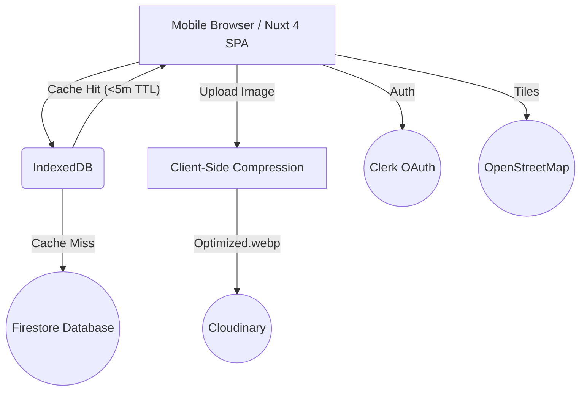

# War Takjil 🌙


*A crowdsourced takjil tracker helping you find the best spots during the holy month of Ramadan.*

**War Takjil** is a mobile-first web app designed for real-time takjil (Indonesian breaking-fast food) tracking. It is an open, crowdsourced map platform where users can discover and report takjil sellers' locations, statuses, and availability in real-time, right before iftar.

## The Problem We're Solving

Every Ramadan, people face the same frustrations:

- Driving around looking for takjil spots, wasting precious time before iftar.
- Arriving at their favorite seller only to find them completely sold out.
- Not knowing what's available nearby or missing good spots hidden in small streets.

**War Takjil** solves this by providing a live, crowdsourced Google Maps-style application specifically tailored for takjil hunting.

---

## Features ✨

- **Real-time Map:** Live heatmap and markers of takjil sellers around your area. Green for "Available", Yellow for "Low Stock", and Red for "Sold Out".
- **Instant Reporting:** Drop a pin, take a quick photo, and set the status in 3 simple taps.
- **Status Updates:** Live tracking of seller inventory statuses with auto-expiring reports to ensure freshness. Old reports automatically expire after 2 hours.
- **Client-Side Caching:** Optimized with aggressive IndexedDB caching for blazing-fast, offline-ready performance.
- **Mobile-First Focus:** Designed exclusively for mobile viewports, perfect for quick on-the-go checking before iftar.


*The main map interface displaying green, yellow, and red pins representing takjil spots, optimized for a seamless mobile experience.*

---

## Tech Stack 🛠

This project is built for speed, real-time updates without backend complexities, and free-tier efficiency:

- **Runtime & Package Manager:** Bun
- **Frontend Framework:** Nuxt 4 (Vue 3, SSR Disabled / SPA)
- **Styling & UI Components:** TailwindCSS v4, Shadcn-vue, Radix Vue
- **Database:** Firebase Firestore (Free Tier, utilizing Geo-queries)
- **Authentication:** Clerk (Google OAuth integration for reporters and sellers)
- **Image Processing:** Cloudinary (Direct Upload) with client-side compression via CompressorJS
- **Maps Setup:** Leaflet.js with OpenStreetMap (via Vue-Leaflet)
- **Storage/Caching:** IndexedDB integration for an aggressive local cache-first strategy.

---

## Architecture & Data Flow 🏗

The application runs entirely on the client side (SPA mode) with zero Edge or Server Functions.



*Architecture flow: Requests dynamically intercept the local IndexedDB layer for a 5-minute TTL cache before ever communicating with Firestore, keeping the application extremely lightweight and affordable.*

1. **Map Tracking:** Map viewport changes natively trigger Geohash-based bounding box calculations on the client.
2. **Caching First:** Requests intercept the local IndexedDB layer for a 5-minute TTL cache before hitting Firestore, ensuring we stay within Firebase Free Tier limits (<10 reads per user).
3. **Data Integrity:** Reports expire automatically in 2 hours via Firestore TTL policies and client filtering, ensuring data is always fresh and accurate.
4. **Optimized Images:** Spot photos are compressed directly on the client (max 1920px, 80% quality) and sent securely to Cloudinary, ensuring no heavy data transfer. NO Firebase Storage is used.

---

## Get Started 🚀

### 1. Prerequisites

- Setup [Bun](https://bun.sh/)
- Get API Keys for **Firebase**, **Clerk**, and **Cloudinary**

### 2. Environment Variables

Create a `.env` file in the root of the project with your API keys. Refer to `nuxt.config.ts` for the variables required:

```bash
# Firebase
NUXT_PUBLIC_FIREBASE_API_KEY=your_key
NUXT_PUBLIC_FIREBASE_AUTH_DOMAIN=your_domain
NUXT_PUBLIC_FIREBASE_PROJECT_ID=your_id
NUXT_PUBLIC_FIREBASE_MESSAGING_SENDER_ID=your_sender
NUXT_PUBLIC_FIREBASE_APP_ID=your_app_id

# Clerk
NUXT_PUBLIC_CLERK_PUBLISHABLE_KEY=your_clerk_key

# Cloudinary
NUXT_PUBLIC_CLOUDINARY_CLOUD_NAME=your_cloud_name
NUXT_PUBLIC_CLOUDINARY_UPLOAD_PRESET=your_preset
```

### 3. Installation

Install all the required dependencies using Bun:

```bash
bun install
```

### 4. Development Server

Start the application on `http://localhost:3000`:

```bash
bun run dev
```


*Users can easily report stock availability, take photos of the stalls, and view details about the takjil menus right from their browser.*

### 5. Production Build

Build for production:

```bash
bun run build
```

Preview locally:

```bash
bun run preview
```

---

## Contributing & Constraints 🤝

Contributions are welcome. Before making any changes, please check `CONTRIBUTION_GUIDE.md` for specific technical decisions.


*Don't miss out on your favorite takjils before iftar! Help the community by pinning your discoveries.*
